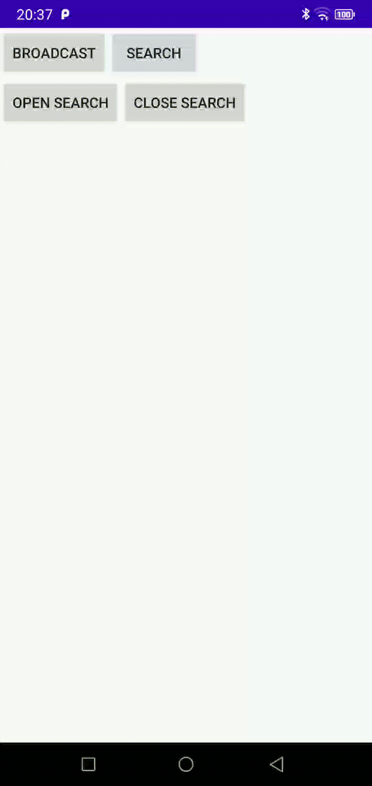

# LAN-COMM
## 1 功能简介
LAN-COMM，即LAN Communicate，局域网通讯技术，基于同一局域网下的设备，相互发现与通讯。

LAN-COMM主要用于在同一局域网下的设备之间的相互发现与通讯。
您可以：

1. 主动搜索位于同一局域网下的同一设备；
2. 通过开关控制是否被其他设备搜索到；
3. 给处于同一局域网下的所有设备发送广播消息；
4. 给指定设备发送点对点消息；
5. 监听广播消息、监听点对点消息；
6. 监听其他设备上下线通知消息；

demo示例：




## 2 使用说明
### 2.2 搜索
> 通过LanCommManager.getSearcher()您可以获取LAN-COMM的搜索器，通过搜索器，您可以主动搜索当前局域网下的所有设备。  
也可以通过开关配置是否可以被其他设备搜索到。  

搜索其他的设备：
```
LanCommManager.getSearcher().startSearch(new SearchListener() {
            @Override
            public void onSearchStart() {
                //开始搜索
            }

            @Override
            public void onSearchedNewOne(Device device) {
                //搜索到设备
                Log.d(TAG, "onSearchedNewOne() " + device.toString());
            }

            @Override
            public void onSearchFinish(HashMap<String, Device> devices) {
                //搜索完成
                //devices为搜索到的所有设备，它的key为此设备的IP地址
            }
        });
```


设置是否可以被其他设备搜索
```
//设置可以被其他设备搜索
LanCommManager.getSearcher().setCanBeSearched(true);

//设置不能被其他设备搜索
LanCommManager.getSearcher().setCanBeSearched(false);
```


当前是否可以被其他设备搜索
```
boolean canBeSearch = LanCommManager.getSearcher().isCanBeSearched();
```

### 2.2 消息接收
> 通过LanCommManager.getReceiver(); 您可以获取到LAN-COMM的消息接收器，通过接收器，可以接收到其他设备发送的广播消息和点对点消息，以及其他设备上下线的通知消息。  

接收与不接收其他设备发送的广播消息和点对点消息
```
DataListener listener = new DataListener() {
            @Override
            public void onBroadcastArrive(CommData commData) {
                //接收到广播消息
            }

            @Override
            public void onCommandArrive(CommData commData) {
                //接收到点对点消息
            }
        };
//接收其他设备发送的广播消息和点对点消息
LanCommManager.getReceiver().addDataListener(listener);

//移除其他设备发送的广播消息和点对点消息的监听
LanCommManager.getReceiver().removeDataListener(listener);
```
### 2.3 广播消息
> 通过LanCommManager.Broadcaster(); 您可以获取到LAN-COMM的广播器，通过广播器，可以给所有设备发送广播消息。  
通过广播器发送的消息，可以在[2.2 消息接收]中的消息接收器中接收到发送的消息，自己发送的消息自己也是可以接收到的。  

发送广播消息
```
LanCommManager.getBroadcaster().broadcast("Hello LAN-COMM".getBytes());
```

### 2.4 点对点消息
> 通过LanCommManager.getCommunicator(); 您可以获取到LAN-COMM的点对点通讯器，可以给指定的设备发送消息。  
发送的点对点消息可以在[2.2 消息接收]中的消息接收器中接收到发送的消息。

发送点对点消息
```
//
Command command = new Command().setDestIp(device.getIp())
                .setData("我点你了，哈哈~".getBytes())
                .setCallback(new Command.Callback() {
                    @Override
                    public void onSuccess() {
                        //发送成功
                        Trace.d(TAG, "send success");
                    }

                    @Override
                    public void onError(int code) {
                        //发送失败
                        Trace.d(TAG, "onError() " + code);
                    }

                    @Override
                    public void onReceived() {
                        //对方已收到
                        Trace.d(TAG, "对方已收到");
                    }
                });

LanCommManager.getCommunicator().sendCommand(command);
```

### 3 Kotlin扩展函数

#### 3.1 获取管理类
```
        //获取广播器
        broadcaster

        //获取接收器
        receiver

        //获取搜索器
        searcher

        //获取点对点消息器
        communicator
```
#### 3.1 发送点对点消息
```
//发送点对点消息
        sendCommand{
            destIp = "192.168.1.13"
            data = "我点你了，哈哈~".toByteArray()
            callback = object : Command.Callback {
                override fun onSuccess() {
                }

                override fun onReceived() {
                }

                override fun onError(code: Int) {
                }
            }
        }
```